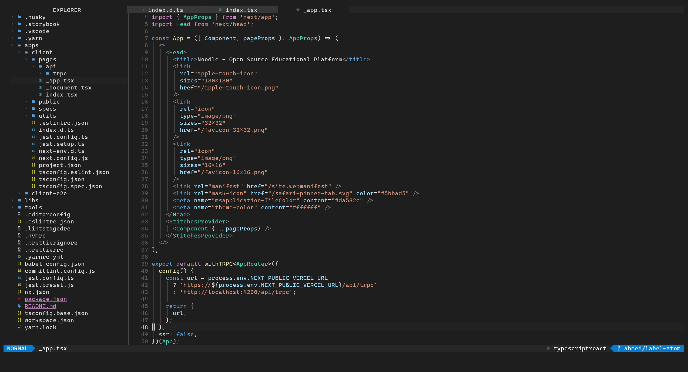

# ixahmedxi's neovim config

> This is my personal neovim configuration which is used for web development with Typescript mainly.

## Included

- Impatient for lazy loading
- Native lsp configuration with lspconfig, lsp-installer, null-ls and typescript.nvim.
- Treesitter with autopairs and autotag
- Which key
- Tmux plugin
- Toggleterm
- Vscode like theme
- And much more!

## Aims

I wanted to switch from Vscode to neovim for a long time but haven't gotten around to doing so. I had neovim integrated with vscode which was a really nice setup but I wanted something that is more lightweight and that I can fully customise to my liking. I also wanted a configuration that works well with all the common web dev tools like typescript, eslint, prettier...etc
